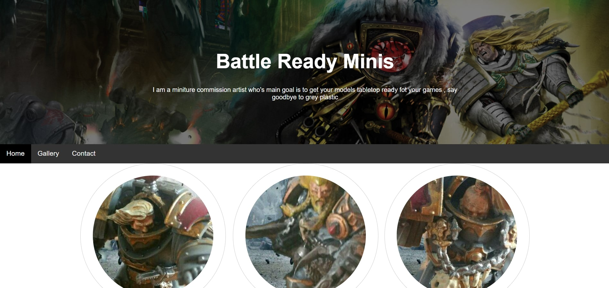

# Battle Ready Minis

Battle ready minitures is a fictional minture model painting studio founded by a team of painters who want to help
people get thier models painted cheap and easy so that more people would have painted models on the table top 

Link to the deployed website [Battle Ready Minis](https://orihillairetdev.github.io/battle-ready-minis/)

## 1. UX

#### 1.1. Project Goals

The website is desgined to be a commision painting site for wargames 
and hobby painters if a person does not want to or have the time to 
paint his own minitures he can come here and make use of the service 

Once they have clicked on the website they will get a small description 
and have 3 options home gallery and contact us 

Home holds all of the base information

Gallery shows examples of the qauility of work 

Contact will be where the customer can contact the studio 

The end goal is a simple website that will allow the customer to get all the information they beed 
and get into contact with in a simple and easy manner.

#### 1.2. User Stories

* As an owner, I want to show models and examples of our work.
* As an owner, I want to offer the possibility to hire a artist via email.
* As an owner, I want my website to be easy to use and simple as to get the 
  point across without problems.
* As a user, I want to be able to get in into contact with the studio on multiple platforms.
* As a user, I want to be able to see examples of the work that is offered.
* As a user, I want to be able to see how the studio works and what they offer.
* As a user, i want to be able to easily access the social media accounts
  
 #### 1.3 Wireframe

[Home](battle-ready-minis/Readme/Wireframes/Home/) 

[Gallery](battle-ready-minis/Readme/Wireframes/Gallery/) 

[Contact](battle-ready-minis/Readme/Wireframes/Contact/) 

## 2. Features

#### 2.1. Existing features

The Header includes:

* Studios name: allows the user to know what studio they are dealing with.
* Navigation Bar: allows users to navigate the site in an easy and intuitive way.

The Footer includes:

* Pricing details: A small list of the pricing used by the studio.
* Social: a collection of social media link that will take the user to those affliliated pages.
* Both the Header and the Footer are consistent throughout the website.

####  2.2. Features left to implement in the future

* More technical gallery: I would like to change the gallary to a more dynamic and technical version.
* Videos: add videos of painting techniques and showcases.

## 3. Technologies used

- [HTML5](https://en.wikipedia.org/wiki/HTML5) - provides the content and structure for my website.
- [CSS3](https://en.wikipedia.org/wiki/Cascading_Style_Sheets) - provides the styling.
- [Bootstrap](https://getbootstrap.com/) - used to create the layout of the project.
- [Figma](https://www.figma.com/) - used to create the project's wireframes.
- [Gitpod](https://gitpod.io/) - used to develop the website.
- [GitHub](https://github.com/) - used to host the project.
- [Google Fonts](https://fonts.google.com/) - used to provide the fonts Josefin Slab for the main text, and Fredericka the Great for headers.
- [Font Awesome](https://fontawesome.com/) - used the font awesome icons to style the information and the links in the footer, and also to make the Reservation section stand out a small bit.

## 4. Testing

The testing process can be seen [here](TESTING.md).

## 5. Deployment

**To deploy the project**

This project is hosted in GitHub Pages

1. On the menu on the top of the project’s repository on GitHub select Settings.
2. Scroll down to the GitHub Pages section.
3. Inside that section, click on the drop-down menu under Source and select Master Branch.
3. The page refreshes automatically and the website is now deployed.
4. The link to the webpage is just in the GitHub Pages section down below.

Only one branch has been used for this project.

**To run the project locally**

To clone this project from GitHub:

1. Under the repository’s name, click Clone or download.
2. In the Clone with HTTPs section, copy the given URL.
3. In your IDE of choice, open Git Bash.
4. Change the current working directory to the location where you want the cloned directory to be made.
5. Type git clone, and then paste the URL copied from GitHub.
6. Press enter and the local clone will be created.

## 6. Credits

#### 6.1. Content

Most of the text in this site was made up my myself for the website.

Took inspiration from the love running project and multiple model paitning Studios
of various fidelity.

####  6.2. Media

The images where taken on my samsung note 4, the rest where sourced for the websites "ForgeWorld" "DakkaDakka" .
all rights belong to Games workshop and Forge world 

####  6.3. Acknowledgments

Precious Ljege for helping me sort out my mess and in fixing it 

Student Help for replying to my many emails asking questions 
